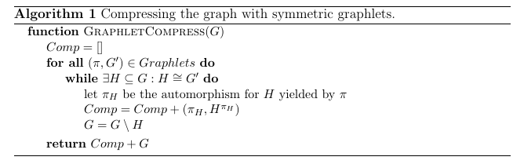
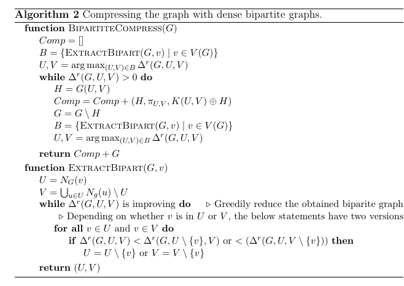

# Symmetry-compressible graphs (DCC 2017)

This repository contains the poster and some additional material for the poster "Symmetry-compressible graphs", presented at Data Compression Conference 2017 (Snowbird, Utah).

## Algorithms

Two algorithms were tested:
- Graphlet compression
- Bipartite compression

### Graphlet search

The first step for this algorithm, we did an exhaustive search in the set of all connected graphs (graphlets) of sizes 4-9. We identified all graphlets that are symmetry-compressible. The table below summarizes these results, showing the number of graphlets considered and the number of symmetry-compressible graphlets found.

| size | all graphlets  | sym. compressible |
| :------------- | :------------- |
| 4       |  6      |  3   |
| 5       |   21     |  13 |
| 6       |   112     | 87  |
| 7       |   853     | 649  |
| 8       |   11117     | 7254  |
| 9       |   261080     | 126221  |

The algorithm uses a list of these graphlets as the basis for the compression.
 For each graphlet G' in this list, a maximal set of edge-disjoint subgraphs H that are isomorphic to G' are found. All such subgraphs H are removed from G and their symmetry representation $(\pi, H^\pi)$ is used instead.
 To achieve better results (a higher compression ratio), a heuristic rule is used. Namely, the list of graphlets is initially sorted by decreasing compression ratio. The intuition behind this heuristics is that we need to find the most compressible patterns first, otherwise the removal of subgraphs makes such patterns less likely to occur.

The image below gives a more detailed description of the algorithm.

### Bipartite graphs

 Here, we pick the family of complete bipartite graphs, which have simple symmetries that also have a large relative efficiency. The algorithm searches for such subgraphs repeatedly, using a similar approach as the graphlet compression.

## Experiments

The poster shows a short overview of the experiment.
We used 6 well-known graphs (often used in studies in network science) and compressed them with both algorithms.

| dataset | graph size     |  graphlet alg. | bipartite alg. |
| :------------- | :------------- | :------------- | :------------- |
| karate       | 78       | 54  |  55 |
| yeast       | 6650       | 4969  |  5372 |
| powergrid       | 6594       | 6046  |  6261 |
| jazz       | 2742      | 1246  |  1306 |
| lena       | 1339     | 678  |  705 |
| facebook       | 88234       | 44559  | 40457 |

All the test graphs are given in the 'experiments' directory. The raw input is given in .net files, which is simply a list of edges of the graph. The compressed graph is given in .scg files, the format of which is described below.

## The format of the compressed file (.scg)

The basic format is a text file

    num. vertices ! residual graph ! sim_1 ! sim_2 ! ... ! sim-k

The residual graph is a sequence of edges,e.g.

    1:2|3:7|...|5:9

The symmetry is represented as a base graph, and a symmetry. The base graph is a sequence of edges (as above), and the symmetry is a sequence of pairs, also written as above. The symmetry and the base graph is divided by a semicolon ';'.

### Example

    10!1:5|2:5|3:5|4:5!0:8|0:9|0:6|0:7;0:1|1:2|2:3|3:4
